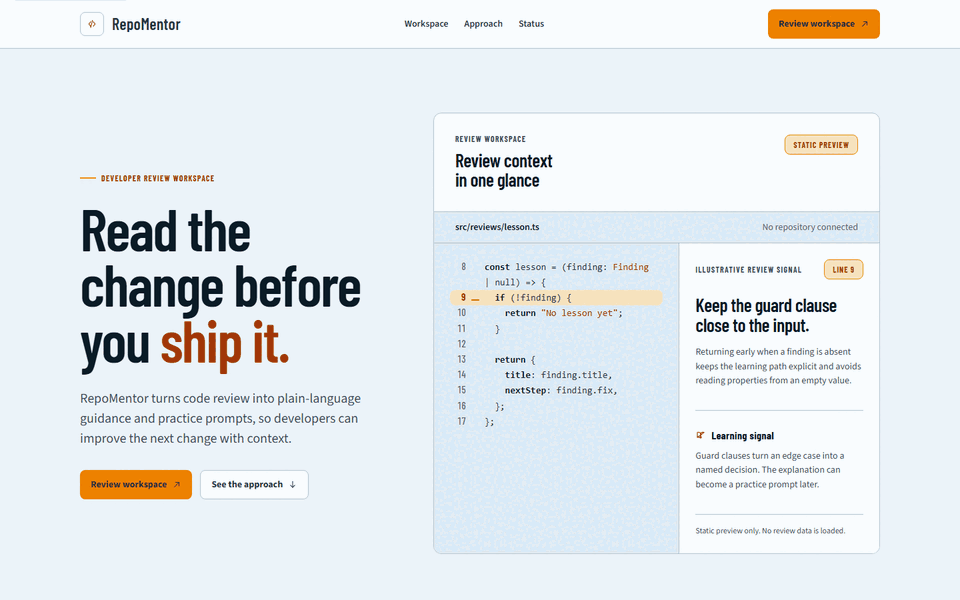

# RepoMentor

RepoMentor is a developer-first workspace for AI-assisted code review and
programming practice. It is a production-oriented monorepo, but the current
repository checkpoint is an application slice, not a production release.

The current code/evidence baseline is the exact implementation checkpoint
`953e7da`, which includes the authenticated review-detail route, application CI
gates, and dependency-audit remediation after the settings and security
slices. These SHAs are exact-head evidence anchors for the local checks
recorded below; they are not a release, tag, registry, license,
package-publication, deployment, or production-readiness claim.

## Current status

This checkpoint contains:

- a Next.js App Router web shell with home, sign-in, and registration routes;
- a NestJS API with application health, authentication, and owned review
  persistence routes;
- an isolated server-side Luna review boundary with fixed provider/model
  selection, strict bounded output validation, prompt-injection framing, typed
  retry/timeout/cancellation/error handling, deterministic tests, and
  server-only `LUNA_*` configuration;
- shared Zod contracts for success envelopes, problem envelopes, health, and
  authentication payloads;
- Prisma schema and forward-only PostgreSQL migrations for users, sessions,
  and reviews;
- a local-only Docker Compose application layer for the API and web images,
  PostgreSQL, and Redis, with localhost-bound ports and health-gated startup;
- owner-scoped usage summary, history, and quota read routes;
- authenticated review and usage web transports that keep access tokens in
  memory only, use explicit Bearer headers, and retain deterministic guest
  fixtures when no session is present;
- strict web logout through the API-owned refresh-cookie boundary, with an
  accessible sign-in/sign-out header action and retry-safe failure state;
- authenticated review cancellation through the API-owned cancel boundary,
  with strict `CANCELLED` response validation and reset/unmount cleanup;
- a public `POST /api/v1/guest/reviews` QUICK path with server-controlled
  pinned Luna metadata, source-free transient responses, and bounded
  per-identity Redis quota admission;
- an authenticated quota-admission path for `POST /api/v1/reviews` with a
  bounded `Idempotency-Key`, atomic Redis admission markers, durable Prisma
  `QuotaAdmission` state, versioned keyed request fingerprints, and a
  Prisma-backed review finalizer;
- one shared server-side Redis executor/configuration seam used by the
  authenticated admission boundary and the Redis quota/lock primitives;
- a Redis-backed review process lock wired into processing with bounded lease
  renewal, lease-loss fencing, and safe release;
- authenticated status-only SSE lifecycle events with exclusive replay,
  bounded heartbeats, polling fallback, explicit cancellation, and owner
  isolation;
- a strict Luna education result payload for improved source, unified diff,
  generated tests, and learning questions, rendered as text-only web views
  with copy/download actions;
- focused unit and in-memory controller tests for the implemented boundaries.
- an authenticated `PATCH /api/v1/auth/password` boundary that verifies the
  current password, atomically updates the Argon2id hash, revokes all active
  sessions, clears the refresh cookie, and requires re-authentication;
- an authenticated `/settings` route with a strict password-change form that
  keeps the access token in memory and clears it only after a validated success;
- an authenticated `/reviews/[id]` detail route that reopens owner-scoped
  history records, validates detail/result envelopes, and labels demo fixtures;
- persisted review `title`, `context`, and `learnerLevel` metadata propagated
  through admission, version-2 request fingerprints, Prisma/in-memory
  persistence, bounded Luna prompt framing, and source-free owner responses.
- explicit HTTP transport hardening for CORS origin allowlists, credentials,
  security headers, JSON/form body limits, request-id error responses, and
  production-safe environment validation.
- a credential-free application CI workflow covering Prisma, contracts, tests,
  formatting, lint, typecheck, builds, package payloads, and fail-closed audit;
- patched dependency resolution for the audited Playwright, Effect, and
  js-yaml advisories.

The authenticated admission contract requires Bearer authentication and a
bounded `Idempotency-Key`. It canonicalizes the language (NFC, trim, and
lowercase), preserves source as data, resolves an omitted mode to `STANDARD`,
and rejects a null or invalid mode before mutation. The server normalizes and
hashes the idempotency material, computes a version-2 HMAC-SHA-256 request
fingerprint over the canonical source/language/mode/learner-level/metadata
fields, creates an owner-scoped
durable `QuotaAdmission` intent, and reserves the authenticated UTC-day quota
with one Redis `EVAL` operation. The finalizer then creates or safely replays
the owned pending review through the Prisma boundary; raw idempotency material
and the fingerprint secret are not stored in durable records. A new admission
returns `201`, an identical owner replay returns `200`, a conflicting reuse is
`409`, confirmed quota denial is `429` with bounded `Retry-After`, and uncertain
Redis or persistence outcomes fail closed into safe unavailable/reconciliation
states rather than being blindly retried or compensated.

The current fingerprint version is `2` and includes the canonical source,
language, mode, learner level, and optional title/context metadata. Metadata
is bounded, validated server-side, and framed as untrusted data for Luna; it
is never treated as instructions or returned with source code in list/result
envelopes.

`QUOTA_ADMISSION_FINGERPRINT_SECRET` is server-only configuration. It must be
32 to 4096 UTF-8 bytes outside test-only injection; HTTP callers cannot supply
the fingerprint or its version metadata. The shared `REDIS_COMMAND_EXECUTOR`
and `USAGE_REDIS_CONFIG` seam feeds the lazy node-redis adapter, which disables
the offline queue and reconnects, applies bounded command/connect deadlines,
and preserves operation-specific redacted errors. The review process uses
`SET NX PX` with an opaque token, bounded renewal, compare-and-delete Lua
release, and conditional generation fencing when a lease is lost. The guest
route is transient and does not create history records. Authenticated review
processing remains synchronous, but exposes a status-only SSE/reconnect
transport with bounded polling fallback; no durable background queue is
claimed. None of this local evidence proves live PostgreSQL, Redis/EVAL, HTTP
provider, or external Luna behavior. Authenticated web review and usage pages
use the API transport when a memory-only session exists; guest usage remains
explicitly deterministic/demo-labelled.

## Architecture

```text
apps/web/       Next.js 16 web shell and auth forms
apps/api/       NestJS API, auth/session/review boundaries, isolated Luna AI provider, Prisma adapters
packages/contracts/  Zod schemas and TypeScript types shared by API/tests
prisma/         PostgreSQL schema and append-only migrations
docker-compose.yml   Local API/web images plus PostgreSQL and Redis services
docs/           Architecture decisions, release boundaries, and media capture
```

Useful project notes:

- [API route and health notes](apps/api/README.md)
- [Web visual foundation and honest UI boundaries](apps/web/DESIGN.md)
- [Architecture map and system boundaries](docs/architecture.md)
- [API design and route contracts](docs/api-design.md)
- [Database design and migration policy](docs/database-design.md)
- [Security and trust boundaries](docs/security.md)
- [Luna prompt design](docs/ai-prompt-design.md)
- [Testing strategy and evidence limits](docs/testing-strategy.md)
- [Local deployment and release workflows](docs/deployment.md)
- [Contributing and repository gates](CONTRIBUTING.md)
- [Commit, branch, and worktree strategy](docs/commit-strategy.md)
- [Optional RAG suggestion provider ADR](docs/architecture/adr-001-optional-rag-suggestion-provider.md)
- [Prisma migration ownership](docs/architecture/database-migration-ownership.md)
- [Release, tag, and package boundaries](docs/release.md)
- [Application CI gates and evidence boundaries](docs/ci.md)
- [UI media capture script](docs/media/capture-ui-media.ps1)

## Implemented routes

### Web

| Route                                    | Current behavior                                                                                                                                   |
| ---------------------------------------- | -------------------------------------------------------------------------------------------------------------------------------------------------- |
| `/`                                      | Static product shell with review preview, learning-loop copy, and an explicit empty state.                                                         |
| `/login`                                 | Client-side sign-in form wired to `POST /api/v1/auth/login`.                                                                                       |
| `/register`                              | Client-side registration form wired to `POST /api/v1/auth/register`.                                                                               |
| `/dashboard`                             | Usage summary, recent source-free history, and quota read through the authenticated API transport when signed in; deterministic fixture otherwise. |
| `/history`                               | Source-free paginated usage history; guest fixtures expose local filters, while the API path keeps page/limit-only controls.                       |
| `/usage`                                 | Token, operation, and quota overview through the same authenticated API/demo boundary.                                                             |
| `/settings`                              | Authenticated password-change form backed by `PATCH /api/v1/auth/password`; successful changes require re-authentication.                          |
| `/reviews/[id]`                          | Owner-scoped review detail/result view reached from history; unauthenticated saved-review access stays generic and source-safe.                    |
| Loading, error, and not-found boundaries | Honest shell-preserving states for the current App Router surface.                                                                                 |

The home review preview remains static and does not load repository data. The
dashboard, history, and usage routes are connected to their accepted API read
contracts when a session exists; live backend dependencies remain unverified
by the local deterministic checks.

### API

The API uses `/api/v1` as its global prefix except for the three health routes.
Successful responses are wrapped as `{ "data": ... }`; failures use an
`{ "error": ... }` problem envelope and a bounded `X-Request-Id` header.

| Method and route                   | Implemented behavior                                                                                                                  |
| ---------------------------------- | ------------------------------------------------------------------------------------------------------------------------------------- |
| `GET /health/live`                 | Process liveness: `{ "data": { "status": "ok" } }`.                                                                                   |
| `GET /health/ready`                | Application-only readiness. It does not probe PostgreSQL, Redis, or AI.                                                               |
| `GET /health/metrics`              | Aggregate process-local request counters; no route labels, source, provider, dependency, or credential data.                          |
| `GET /api/docs`                    | Swagger UI for the current API document.                                                                                              |
| `POST /api/v1/auth/register`       | Validates input and returns `202` with `{ "accepted": true }`; new and duplicate emails are intentionally indistinguishable.          |
| `POST /api/v1/auth/login`          | Returns a short-lived Bearer access token and public user data in a `201` success envelope.                                           |
| `POST /api/v1/auth/refresh`        | Reads and rotates the API-owned refresh cookie.                                                                                       |
| `POST /api/v1/auth/logout`         | Revokes the presented refresh session when valid and clears the cookie; malformed or repeated logout is idempotent.                   |
| `POST /api/v1/auth/logout-all`     | Authenticated session revocation for every session belonging to the user.                                                             |
| `PATCH /api/v1/auth/password`      | Verifies the current password, changes the Argon2id hash, revokes all active sessions, clears the refresh cookie, and requires login. |
| `GET /api/v1/auth/me`              | Returns the authenticated public user.                                                                                                |
| `POST /api/v1/reviews`             | Requires authentication and a bounded `Idempotency-Key`; reserves quota and creates or safely replays an owned `PENDING` review.      |
| `GET /api/v1/reviews`              | Lists only the authenticated user's active reviews with page, limit, and status filtering.                                            |
| `GET /api/v1/reviews/:id`          | Returns one owned review, including source code.                                                                                      |
| `DELETE /api/v1/reviews/:id`       | Soft-deletes one owned review and returns `204`.                                                                                      |
| `POST /api/v1/reviews/:id/retry`   | Moves an owned review back to `PENDING` when the status policy allows it.                                                             |
| `POST /api/v1/reviews/:id/cancel`  | Moves an owned review to `CANCELLED` when the status policy allows it.                                                                |
| `POST /api/v1/reviews/:id/process` | Runs one bounded synchronous Luna review; returns a source-free completion or idempotent skip response.                               |
| `GET /api/v1/reviews/:id/result`   | Returns one owned completed result with validated findings and safe Luna execution metadata; non-completed reviews return `409`.      |
| `GET /api/v1/usage/summary`        | Returns an owner-scoped, source-free usage summary.                                                                                   |
| `GET /api/v1/usage/history`        | Returns owner-scoped, source-free history with bounded filters and stable pagination.                                                 |
| `GET /api/v1/usage/quota`          | Returns the authenticated UTC-day quota read model and configured limits.                                                             |

Review statuses are `PENDING`, `PROCESSING`, `COMPLETED`, `FAILED`, and
`CANCELLED`. Processing accepts no provider, model, or prompt options from the
client. Successful processing responses contain only the review ID, status,
outcome, and result-availability flag; result data is available only through
the owner-scoped result endpoint.

## Local setup

Prerequisites:

- Node.js `>=22.0.0` (the validation runtime was `v24.12.0`);
- pnpm `11.0.9`, selected by the root `packageManager` field;
- Docker is optional for the unit/in-memory checks; a Docker daemon is required
  for Compose image builds, startup, and live smoke checks.

Install the locked workspace without running third-party lifecycle scripts:

```bash
corepack enable
pnpm run deps:install
```

Copy `.env.example` to an untracked `.env` and fill values locally. Compose
requires `DATABASE_URL` and `REDIS_URL` to use the `postgres` and `redis`
service names inside the Compose network; URL-encode credential components
before placing them in those URLs. The API also requires two different
authentication secrets of at least 32 bytes. Generate secrets locally instead
of copying credentials into a command history or commit:

```bash
node -e "console.log(require('node:crypto').randomBytes(32).toString('base64url'))"
```

Quota and admission configuration is server-side. The authenticated daily
limits default to QUICK/STANDARD/DEEP `20/10/3` and are configured with
`USER_QUICK_REVIEWS_PER_DAY`, `USER_STANDARD_REVIEWS_PER_DAY`, and
`USER_DEEP_REVIEWS_PER_DAY` (each bounded from `0` to `100000`).
`QUOTA_ADMISSION_FINGERPRINT_SECRET` is required outside test-only injection,
must be a non-empty UTF-8 secret of 32 to 4096 bytes, and is used only by the
server to derive versioned request-fingerprint hashes. HTTP callers cannot
provide this secret or the resulting fingerprint metadata. Compose requires
it; keep the `.env.example` placeholder empty and never commit a real value.

The Redis primitive configuration also accepts `GUEST_QUICK_REVIEWS_PER_DAY`
(default `3`), `USAGE_REDIS_QUOTA_TTL_MAX_SECONDS` (default `86400`, bounded
to `1..86400`), and `USAGE_REDIS_LOCK_TTL_MS` (default `10000`, bounded to
`1000..60000`). Guest quota remains a primitive/configuration boundary with no
guest HTTP route, and the lock TTL is not evidence that processing has a wired
process lock.

The Luna provider boundary is server-side only. Keep `LUNA_API_KEY` in the API
runtime and never expose it to clients. `LUNA_API_BASE_URL` is fixed to
`https://api.openai.com/v1`, the deployment-owned HTTPS allowlisted endpoint;
it is not an arbitrary provider or model selection setting. These variables do
not prove live provider access; deterministic transport tests use a fake Luna
provider and no external AI request is made by the validation suite.

For Compose, set `API_HOST_PORT` and `WEB_HOST_PORT` to unused localhost ports.
`NEXT_PUBLIC_API_ORIGIN` is required as a web image build argument and must be
browser-reachable, normally `http://localhost:<API_HOST_PORT>`. Do not use the
internal `api:3000` service URL here: the value is baked into the Next.js
browser bundle, so changing it requires rebuilding the web image.

The local Compose URL shapes are:

```dotenv
API_HOST_PORT=18080
WEB_HOST_PORT=18081
NEXT_PUBLIC_API_ORIGIN=http://localhost:18080
DATABASE_URL=postgresql://<user>:<url-encoded-password>@postgres:5432/<db>
REDIS_URL=redis://:<url-encoded-password>@redis:6379/0
```

After `DATABASE_URL` is available, prepare generated local artifacts and
validate the schema:

```bash
pnpm db:generate
pnpm --filter @repomentor/contracts build
pnpm db:validate
```

`db:generate` and `db:validate` inspect the Prisma schema; they do not prove
that PostgreSQL is reachable. To validate and start the local API/web plus
PostgreSQL/Redis Compose layer, populate the Compose variables first and run:

```bash
docker compose config --quiet
docker compose up --build -d
```

The web is published at `http://localhost:<WEB_HOST_PORT>` and the API
liveness endpoint is at `http://localhost:<API_HOST_PORT>/health/live`.
Compose waits for PostgreSQL and Redis container health before starting the
API, then waits for the API's process-liveness health before starting the web.
The API healthcheck only tests `/health/live`, and the web healthcheck only
tests `/`; neither claims dependency-aware readiness.
The metrics endpoint is process-local and operational only; it does not claim
live PostgreSQL, Redis, or Luna telemetry and intentionally excludes request
payloads, route labels, provider details, and credentials.

## Development commands

Run the commands from the repository root:

| Command                                     | Purpose                                                                                    |
| ------------------------------------------- | ------------------------------------------------------------------------------------------ |
| `pnpm run deps:install`                     | Frozen dependency install with lifecycle scripts disabled.                                 |
| `pnpm db:generate`                          | Generate the Prisma client after `DATABASE_URL` is set.                                    |
| `pnpm --filter @repomentor/contracts build` | Build the shared contract package before API typecheck/test/build.                         |
| `pnpm dev`                                  | Run present workspace `dev` scripts; use explicit ports when running web and API together. |
| `pnpm --filter @repomentor/api dev`         | Run the NestJS API.                                                                        |
| `pnpm --filter @repomentor/web dev`         | Run the Next.js web shell.                                                                 |
| `pnpm lint`                                 | Lint the root and present workspace packages.                                              |
| `pnpm typecheck`                            | Type-check the workspace after generated artifacts are prepared.                           |
| `pnpm test`                                 | Run the web, contracts, and API test suites.                                               |
| `pnpm build`                                | Build the contracts, static web app, and API after preparation.                            |
| `pnpm format:check`                         | Check Prettier formatting.                                                                 |

The API and web images both listen on container port `3000`; Compose publishes
them on the required `API_HOST_PORT` and `WEB_HOST_PORT` localhost bindings.
For direct `pnpm` development, use separate shells and set
`NEXT_PUBLIC_API_ORIGIN` to the browser-reachable API origin for the web
process.

## Authentication and review API boundary

Authentication is server-owned:

- passwords are hashed with Argon2id and are never returned;
- email and display-name input is normalized and bounded;
- access tokens are returned only in the login/refresh success payload;
- refresh tokens are stored in a rotated, API-owned cookie and are not written
  to browser storage by the web client;
- refresh-token replay revokes the session;
- login, registration, and refresh have bounded in-memory rate limits;
- production rejects insecure cookie configuration and requires distinct
  high-entropy JWT secrets.
- production disables the Swagger UI/document route; development and test
  keep the documented API surface, and every response receives baseline
  clickjacking, MIME-sniffing, referrer, and permissions-policy headers.

Review authorization is user-owned at the repository boundary. List, detail,
delete, retry, cancel, process, and result operations all scope by the
authenticated user ID. Submitted source is treated as untrusted data and is
stored as review input; the current repository never executes it. The
processing route pins the server-owned Luna provider/model and never accepts
client prompt overrides.

Quota admission keeps raw idempotency material out of durable records and stores
only the request fingerprint hash plus explicit version metadata. The
fingerprint secret is server-only, HTTP callers cannot supply the fingerprint
metadata, and ambiguous Redis or persistence outcomes fail closed into bounded
safe statuses rather than being silently retried.

## Validation evidence

The table below is the historical evidence table from the earlier
documentation refresh. The current implementation evidence is recorded in the
checkpoint addendum immediately after it. Both use Node `v24.12.0`, pnpm
`11.0.9`, deterministic test doubles, and non-secret local-only values where
needed; neither proves live PostgreSQL, Redis, HTTP provider, Luna,
deployment, or production readiness.

| Check                                    | Result and evidence                                                                                                                                                                                                                                                                                  |
| ---------------------------------------- | ---------------------------------------------------------------------------------------------------------------------------------------------------------------------------------------------------------------------------------------------------------------------------------------------------- |
| API compile and deterministic test suite | Pass: direct TypeScript test compilation plus `node --test` reports `193/193` tests across `39` suites, with `0` failed and `0` cancelled. The suite includes the shared Redis seam and authenticated admission paths; it uses in-memory repositories, deterministic Redis executors, and fake Luna. |
| Contracts test suite                     | Pass: direct build/test compilation plus `node --test` reports `5/5` contracts tests.                                                                                                                                                                                                                |
| Web shell test suite                     | Pass: `node --test apps/web/test/shell.test.mjs` reports `32/32` tests.                                                                                                                                                                                                                              |
| TypeScript and API build checks          | Pass: direct `tsc --noEmit` for contracts/API/web and direct API build.                                                                                                                                                                                                                              |
| Prisma preparation                       | Pass: direct Prisma generate with a syntactically valid local-only `DATABASE_URL`; no PostgreSQL connection was attempted.                                                                                                                                                                           |
| `docker compose config --quiet`          | Pass with safe dummy values, including the required fingerprint secret; this validates configuration only.                                                                                                                                                                                           |
| `@repomentor/contracts` pack dry-run     | Pass without publishing: `npm pack --dry-run --json` returned JSON for `@repomentor/contracts@0.1.0` with `33` entries. The local payload included `dist/.test-dist` because test compilation had run; this is not an approved publication payload.                                                  |
| Frozen workspace install                 | Attempted with `pnpm run deps:install`; pnpm installed the dependency tree but exited with `ERR_PNPM_IGNORED_BUILDS` while requesting build approval. No approval was enabled; direct local binaries were used for the checks above.                                                                 |
| Docker daemon and live Compose smoke     | Not run: `docker compose config` passed, but `docker info` could not connect to the local Docker Desktop Linux engine. No image build, service startup, live PostgreSQL/Redis check, or HTTP smoke is claimed.                                                                                       |
| Full root test/build and browser capture | Not run in this docs refresh. The checked-in GIF is documented below only as a narrow running-UI-shell capture, not as current backend or live-review evidence.                                                                                                                                      |

## Current checkpoint evidence — 2026-08-08

The current merged and pushed code checkpoint is `953e7da` and
`origin/main` points to the same commit. It passed root `pnpm test`: API
`268/268`, web `46/46`, and contracts `7/7`. The same checkpoint passed
`pnpm typecheck`, `pnpm lint`, `pnpm build`,
`pnpm format:check`, `pnpm package:check`, Prisma validation/generation with a
process-local dummy `DATABASE_URL`, `git diff --check`, and a
credential-shaped scan. `pnpm audit --audit-level=high` reports no known
vulnerabilities after the dependency remediation slice. The API security suite
covers the CORS, body-limit, and header/error boundaries; these are deterministic
checks, not live deployment evidence.

The settings slice was implemented as `0bc05c7` from exact base `576a1ab` and
merged fast-forward. The security slice was implemented as `e5d97ad` from the
same exact base, cherry-picked onto the settings checkpoint as `2b146a5`,
then its equivalent branch ref was deleted after a fresh zero-unique-commit
`git cherry` check. No dirty branch was merged or reset.

The review-detail route was delivered as `ed7aea7` and `32f1378` from exact
base `30eafab`, then fast-forward merged and pushed. Application CI was added
as `295335b`, `f45b224`, and `a4b70d6`; Kongminh accepted the exact worker head
after its path-filter correction. Dependency remediation was merged as
`953e7da` from exact base `a4b70d6` after Advisor acceptance.

The prior exact implementation checkpoint `a5f55c6` passed `pnpm test` with
API `251/251`, contracts `7/7`, and web `42/42`. `pnpm typecheck`, `pnpm lint`,
`pnpm format:check`, `pnpm build`, `pnpm package:check`, Prisma validation and
generation with a process-local dummy URL, and a credential-shaped repository
scan also passed. The checkpoint includes the guest QUICK route, Redis review
process lease/fencing, authenticated status-only SSE/replay with polling
fallback, cancellation/logout boundaries, and the Luna education result
contract plus text-only UI/export views.

Playwright discovery is `1/1`, but execution remains unverified because
Chromium revision `chromium-1161` is not installed locally. No Docker image,
registry artifact, tag, public package, GitHub release, or deployment was
created or claimed.

GitHub Container Validation run `31234347927` passed against the prior code
head `a5f55c6`: workflow, Dockerfile/Compose validation, and both
`linux/amd64` no-publish image builds. This is CI validation evidence only; it
is not a registry publication or deployment.

`.github/workflows/application-gates.yml` now runs the deterministic application
gate set on pull requests and pushes to `main`. The workflow has not yet been
claimed as a completed GitHub run for `953e7da`; its local command evidence and
fail-closed audit behavior are recorded in [docs/ci.md](docs/ci.md).

## Security and environment boundaries

Never commit `.env`, API keys, database credentials, JWT secrets, private
keys, cookies, access tokens, refresh tokens, or user source code. The
committed `.env.example` contains names and empty placeholders only.

The integrated code-review boundary is Luna-only by project policy: provider
`luna`, model `gpt-5.6-luna`, with QUICK/STANDARD/DEEP mapped to low/medium/max
reasoning. It enforces bounded structured results, source/instruction prompt
isolation, typed retry/timeout/cancellation/provider errors, and safe handling
that does not log source or secrets. `LUNA_API_KEY` is server-only and
`LUNA_API_BASE_URL` is the fixed HTTPS allowlisted endpoint
`https://api.openai.com/v1`. The review API still makes no live AI call.

Optional DeepSeek RAG suggestions remain disabled and deferred by
[ADR-001](docs/architecture/adr-001-optional-rag-suggestion-provider.md); no
DeepSeek secret is added, documented, or stored in this checkpoint.

The HTTP hardening slice closes the explicit CORS, body-size, and security
header boundaries, but it does not claim a synchronizer/double-submit CSRF
token, structured audit logging, or distributed rate-limit enforcement.

## Release and media notes

The root package and every current workspace package remain private. There is
no npm/public package artifact, tag, registry publication, or deployment in
this checkpoint. `@repomentor/contracts` is only a future package candidate;
see [docs/release.md](docs/release.md) for exact package, image, tag, and
license gates. The GitHub About table there contains intended values only;
external About state was not changed or verified by this task.



_This is a real capture of the running Next web UI shell only. It shows static
routes; it does not show a live API session, authenticated data, backend review
processing, PostgreSQL, Redis, AI output, or a production deployment._

## Known limitations

- No live PostgreSQL or Redis service was started or verified by the checks
  above. API tests use in-memory repositories and deterministic Redis
  executors.
- The authenticated quota-admission path and synchronous processing/result
  routes are covered with deterministic Redis executors, fake Luna, and
  in-memory repositories only. There is no live Redis EVAL, PostgreSQL
  transaction/isolation, HTTP provider, or external Luna call.
- Guest QUICK review is exposed through `POST /api/v1/guest/reviews`, but live
  Redis quota admission and external Luna execution were not run locally.
- The Redis process lock is wired into the synchronous processing route and
  has deterministic lease/fencing tests; multi-instance live runtime proof is
  not available.
- Authenticated status-only SSE/replay and polling fallback are implemented;
  there is no durable background queue or live multi-instance stream evidence.
- The home shell is static; authenticated review and usage routes use API
  seams, but live backend dependencies and repository data are not verified
  by these local checks.
- The captured GIF is not a browser visual-regression baseline and does not
  claim a live browser session or backend integration.
- The Compose definition covers local API, web, PostgreSQL, and Redis services.
  Configuration validation passed, but the local Docker daemon was unavailable,
  so image builds, service startup, HTTP smoke, and PostgreSQL/Redis dependency
  health remain unverified.
- `NEXT_PUBLIC_API_ORIGIN` is a web build-time value; changing the browser API
  origin requires rebuilding the web image. The Compose healthchecks do not
  provide dependency-aware API readiness.
- The root package and every current workspace package are private; no npm or
  other public package artifact is claimed. `@repomentor/contracts` remains a
  future candidate only. No tag, registry publication, or deployment has
  happened.
- No license file or package `license` field is present. Treat licensing as a
  blocker for a public package or public release until the project owner adds
  a license supported by repository evidence.
- The remaining non-main refs are intentionally protected: `feature/auth-api`
  is clean but stale and unique, while `feature/history-filter-api` and
  `feature/review-process-lock-v2` are dirty. Completed settings/security refs
  were removed only after exact-head/equivalence checks; locked or generated
  worktree residue is preserved rather than force-deleted.
